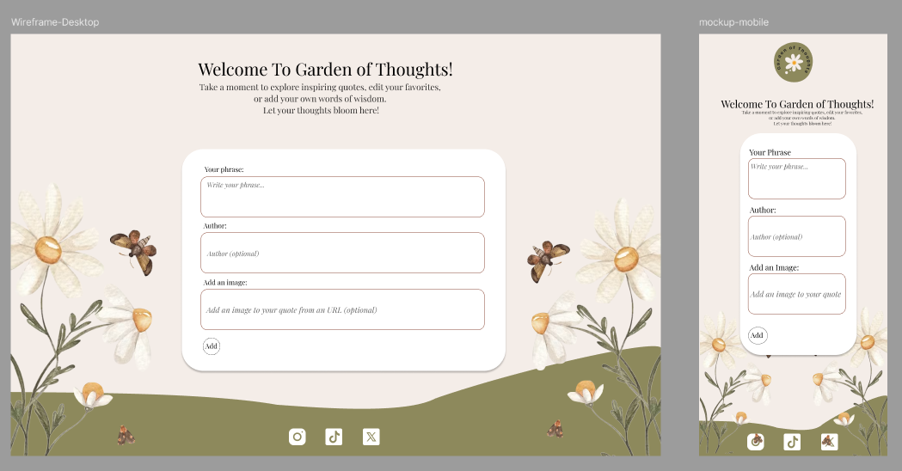

# 🌱 Empowering Phrases App

Welcome! This is a simple, responsive web app where you can create, read, update, and delete empowering phrases, each one tied to an author and, optionally, an image. It's built with **React.js 19** and follows the **Atomic Design** methodology to keep everything modular and scalable.

---

## 🧠 How It Works

Here’s what users can do in the app:

- ✅ View all the phrases and their authors  
- ✅ Add a new phrase and author  
- ✅ Edit any existing phrase or author name  
- ✅ Delete any phrase  
- ✅ Add an image URL (optional)

---

## ⚙️ Tech Stack

We used the following technologies to bring this project to life:

- **React.js 19** (Functional Components + Hooks)
- **JavaScript (ES6+)**
- **HTML5 & CSS3**
- **Sass** (SCSS modules for styling)
- **Node.js v24** (Latest version)
- **Vitest 3.2.4** (for unit testing)

---

## 🧾 Getting Started

To run the app locally, follow these steps:

1. Clone the repository
git clone https://github.com/hgall3/empower-phrases-app.git

2. Move into the project directory
cd empowering-phrases-app

3. Install dependencies
npm install

4. Start the development server
npm run dev

## 👥 The Team

This app was built as a team by:

* [Montserrat Muñoz](https://github.com/Montc027) → Developer
* [Paola Pulga](https://github.com/Pao-Pul) → Product Owner
* [Daniella Pacheco](https://github.com/DaniPacheco8) → Developer
* [Gabriela Gallegos](https://github.com/hgall3) → Scrum Master & Developer
* [Erika P. Montoya](https://github.com/DevErika) → Developer

---

## 🔍 Sneak Peek

Here’s what the app looks like:

